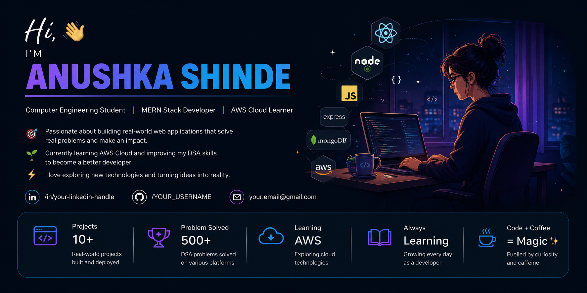

Hi there, I'm Anushka Shinde 👋

  

<h3 align="center">💻 Computer Engineering Student | MERN Stack Developer | AWS Cloud Learner</h3>

  

## 👩‍💻 About Me

- 🎓 Computer Engineering Student
- 💻 Passionate about Full-Stack Web Development
- 🌱 Currently learning **AWS Cloud** and improving **Data Structures & Algorithms**
- 🚀 Building real-world **MERN Stack** projects
- 📚 Exploring **Cloud Computing** and **Open Source**
- 🎯 Looking for **Web Development Internship** opportunities

## 👩‍💻 Tech Stack

- Java
- JavaScript
- React.js
- Node.js
- Express.js
- MongoDB
- MySQL
- AWS Cloud

 🚀 Looking for

- Web Development Internship
- Open Source Contributions

## 📊 GitHub Statistics

 

 

📈 Contribution Graph

  

📫 How to reach me **anushkashinde568@gmail.com**

<h3 align="left">🌐 Connect with me:</h3> 

<h3 align="center">⭐ Thanks for visiting my profile! ⭐</h3>

